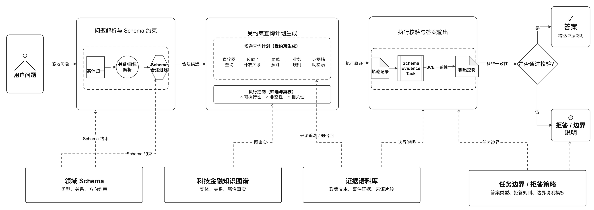
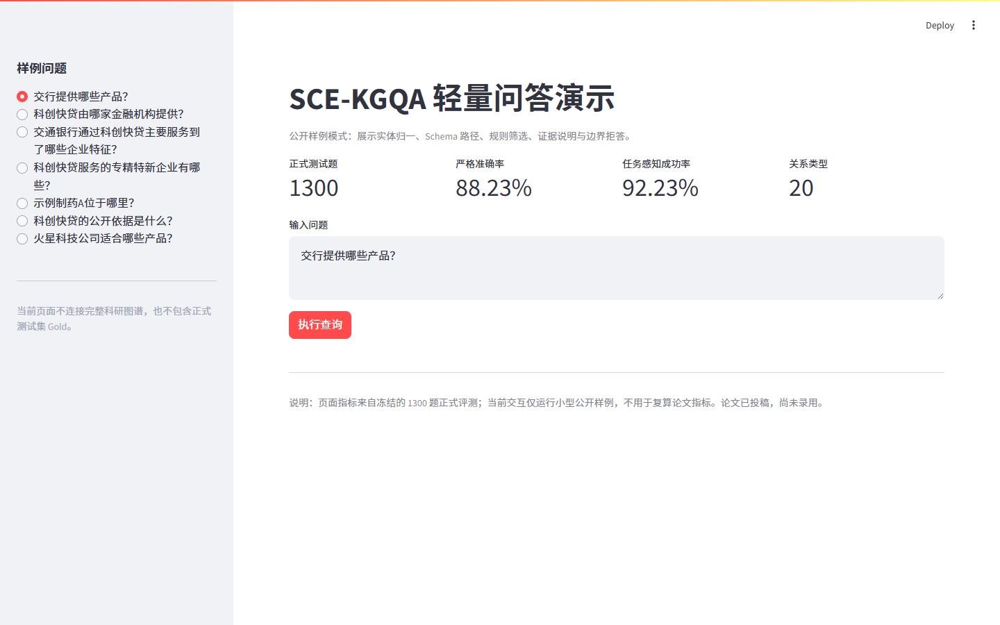

# SCE-KGQA：科技金融知识图谱增强问答系统

> 项目时间：2026 年 3 月至 2026 年 7 月  
> 论文状态：已投稿，尚未录用

## 项目概述

SCE-KGQA 面向甘肃省科技金融知识服务，将政策、金融机构、产品、企业、地区、产业和服务事件组织为业务知识图谱。系统通过实体归一、Schema 路径约束、图查询、规则筛选、证据辅助和边界拒答处理跨对象问题，并保留可检查的关系路径与支持说明。本仓库提供轻量演示、脱敏核心代码和冻结结果摘要。

## 解决的问题

政策文件、产品说明和企业服务记录分散在不同来源中，仅依靠文本相似度难以判断实体类型、关系方向和答案边界。SCE-KGQA 将问题落到领域 Schema 允许的路径上，再执行图查询或规则筛选；当实体、路径或支持依据不足时，系统返回边界说明，而不是强行生成答案。

## 系统架构



主链路为：问题解析与实体归一 → Schema 合法性检查 → 查询计划生成 → 图路径/规则/证据执行 → Schema、Evidence、Task 一致性校验 → 答案或拒答。详细说明见 [docs/architecture.md](docs/architecture.md)。

## 主要技术模块

| 模块 | 作用 |
|---|---|
| 实体归一 | 将企业简称、机构简称和弱表达映射到规范实体 |
| Schema 约束 | 检查实体类型、关系方向、终点类型和合法路径 |
| 图路径执行 | 支持直接查询、反向关系和显式多跳路径 |
| 规则推理 | 按地区、产业、资质和产品条件筛选候选实体 |
| 证据辅助 | 用于来源追溯、事件解释和弱召回补充 |
| 边界拒答 | 在实体无法落地、路径不合法或支持不足时停止输出 |

## 我的主要工作

本人负责需求拆解、领域 Schema 设计、数据处理、环境部署、系统调试、实验设计、结果核验和论文撰写，并围绕正式测试问题持续定位实体归一、关系方向、规则执行、证据对齐与拒答边界问题。

## 技术栈

Python、Neo4j/Cypher、Streamlit、稀疏与向量检索、规则推理、Schema 约束、JSON/JSONL 数据处理、Git。

## 数据与实验规模

| 统计项 | 冻结数值 |
|---|---:|
| 知识图谱节点 | 1707 |
| 图谱关系 | 31018 |
| 业务实体类型 | 11 |
| 关系类型 | 20 |
| 图谱三元组检索记录 | 22152 |
| 文本证据片段 | 5612 |
| 合并检索语料 | 27764 |
| 正式测试题 | 1300 |

## 正式实验结果

| 方法 | Strict Acc. | Task-aware Success |
|---|---:|---:|
| SCE-KGQA | 88.23% | 92.23% |
| HybridRAG | 52.62% | 55.08% |
| Text+KG RAG | 52.46% | 54.85% |
| BM25-RAG | 51.31% | 53.46% |
| Vector-RAG | 48.77% | 51.23% |
| Graph-only KGQA | 43.62% | 47.31% |
| Rule-based KGQA | 42.85% | 45.15% |

上述数字来自冻结的 1300 题正式结果文件，未在展示仓库中重新计算。完整公开表见 [results/official](results/official)，评测口径见 [docs/evaluation.md](docs/evaluation.md)。

## 快速体验

Windows：

```powershell
powershell -ExecutionPolicy Bypass -File .\scripts\run_demo_windows.ps1
```

Linux/macOS：

```bash
bash scripts/run_demo_linux.sh
```

不启动网页也可以运行快速检查：

```bash
python tests/smoke_test.py
```

## 样例问题和输出

```text
问题：交通银行通过科创快贷主要服务到了哪些企业特征？
答案：专精特新中小企业
路径：交通银行 -[providesProduct]-> 科创快贷
      -[servesEnterprise]-> 企业 -[hasFeature]-> 专精特新中小企业
```

样例中的 `servesEnterprise` 属于基于产品目标群体与企业特征建立的扩展关系，不等同于真实贷款事件。更多样例见 [examples/questions.json](examples/questions.json)。

## 界面示例



该截图来自公开展示仓库中的匿名化轻量演示；界面不依赖完整图谱，也不包含正式测试集 Gold。

## 项目目录

```text
src/sce_kgqa/          轻量引擎与脱敏科研核心快照
app/streamlit/         展示界面
data/samples/          少量公开图谱样例，不含正式 Gold
results/official/      冻结主对比表和消融来源表
docs/                  架构、数据、评测和招聘速览
examples/              示例问题与命令行入口
tests/                 无外部服务的 smoke test
```

## 数据与许可说明

仓库仅包含从冻结图谱中抽取的少量脱敏样例，不包含原始网页、PDF、完整图谱、完整证据库或 1300 题 Gold。样例仅用于理解代码流程，不构成新的公开评测集。当前仓库可公开查看，但最终代码和数据许可证尚待确认；在许可证确定前，不授予复制、再分发或衍生使用许可，具体以 [LICENSE_PLACEHOLDER.md](LICENSE_PLACEHOLDER.md) 为准。

## 当前限制

- 轻量演示不连接完整 Neo4j 图谱，也不复算论文指标。
- 完整科研系统依赖未公开的全量数据、索引和冻结运行环境。
- 样例只覆盖部分实体和关系，不代表完整业务覆盖范围。
- 当前方法依赖预设 Schema，面对新增政策、产品和企业时需要更新知识资源。

## 论文状态

配套论文已投稿，尚未录用。本仓库不得被引用为论文已经发表或正式录用的证明。

## 开发说明

项目由作者主导，GPT 和 Codex 用于辅助代码生成、排错和工程迭代；需求定义、Schema 设计、数据处理、实验设计、结果核验和论文撰写由作者负责。
